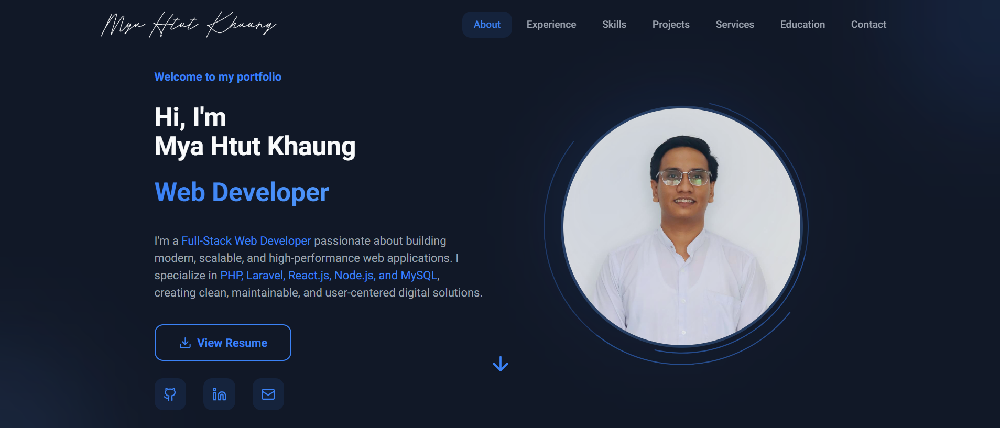

# 💼 My Portfolio Website

A modern, responsive, and interactive developer portfolio built with **Next.js**, **TypeScript**, and **Tailwind CSS**. This portfolio showcases my skills, experience, featured projects, services, education, and provides an easy way for recruiters and clients to contact me.

> Designed and developed by **Mya Htut Khaung**

---

## 🌐 Live Demo

🔗 

---

## 📸 Preview



---

# ✨ Features

- 🎨 Modern UI/UX Design
- 🌙 Dark Theme
- 📱 Fully Responsive
- ⚡ Smooth Page Animations
- 🎭 Framer Motion Animations
- 👨‍💻 Hero Section
- 🙋 About Me Section
- 💼 Experience Timeline
- 🛠 Skills with Progress Bars
- 🚀 Featured Projects
- 💡 Services Section
- 🎓 Education & Certificates
- 📬 Functional Contact Form
- 🔗 Social Media Links
- 📈 SEO Friendly
- ⚙️ Optimized Performance
- ♿ Accessible Components

---

# 🛠 Tech Stack

### Frontend

- Next.js 15
- React
- TypeScript
- Tailwind CSS
- Framer Motion
- Lucide React

### Backend

- Next.js API Routes

### Email Service

- Resend API

### Deployment

- Vercel

---

# 📂 Project Structure

```
portfolio/
│
├── app/
├── components/
├── lib/
├── hooks/
├── public/
├── styles/
├── types/
├── utils/
│
├── package.json
└── README.md
```

---

# 📄 Sections

- Hero
- About Me
- Experience
- Skills
- Projects
- Services
- Education
- Contact
- Footer

---

# 🚀 Featured Projects

### 🖥 Personal Blog System

A complete blogging platform with user authentication, article management, categories, comments, and an admin dashboard.

**Tech Stack**

- PHP
- Laravel
- MySQL
- Bootstrap

---

### 🛒 E-Commerce Website

A modern online shopping platform featuring product browsing, shopping cart, authentication, and order management.

**Tech Stack**

- PHP
- Laravel
- MySQL
- Bootstrap

---

### 📚 School Management System

A web-based school management system designed for managing students, teachers, courses, attendance, and academic records.

**Tech Stack**

- PHP
- Laravel
- MySQL

---

### ☕ Coffee Shop Landing Page

A responsive landing page with modern UI, animations, and engaging visuals for a coffee shop.

**Tech Stack**

- HTML
- CSS
- JavaScript

---

### 🎨 School Project UI/UX Design

A complete UI/UX prototype designed in Figma, focusing on usability, accessibility, and responsive layouts.

---

# 💻 Skills

### Languages

- PHP
- JavaScript
- TypeScript
- HTML5
- CSS3

### Frameworks

- Laravel
- Next.js
- React
- Tailwind CSS

### Database

- MySQL

### Tools

- Git
- GitHub
- Figma
- VS Code
- Postman

---

# 📬 Contact

Feel free to reach out if you'd like to collaborate or have any opportunities.

**Email**

myahtutkhaung2002@gmail.com

**LinkedIn**

https://www.linkedin.com/in/mya-htut-khaung/

**GitHub**

https://github.com/myahtutkhaung2711

---

# ⚙️ Installation

Clone the repository https://github.com/myahtutkhaung2711/mya-htut-khaung-portfolio-V2.git

```bash
git clone 
```

Go to the project directory

```bash
cd portfolio
```

Install dependencies

```bash
npm install
```

Run the development server

```bash
npm run dev
```

Open

```
http://localhost:3000
```

---

# 🔧 Environment Variables

Create a `.env.local` file.

```env
RESEND_API_KEY=
EMAIL_FROM=
EMAIL_TO=
```

---

# 📱 Responsive

This portfolio is optimized for

- Desktop
- Laptop
- Tablet
- Mobile

---

# 📈 Performance

- Lazy Loading
- Optimized Images
- Server Components
- Fast Navigation
- SEO Optimized

---

# 🤝 Contributing

Contributions, issues, and feature requests are welcome.

Feel free to fork this repository and submit a pull request.

---

# ⭐ Support

If you like this project, consider giving it a ⭐ on GitHub.

---

# 👨‍💻 Author

**Mya Htut Khaung**

Full Stack Web Developer | UI/UX Designer

GitHub: https://github.com/myahtutkhaung2711

LinkedIn: https://linkedin.com/in/yourprofile

---

## 📄 License

This project is licensed under the MIT License.